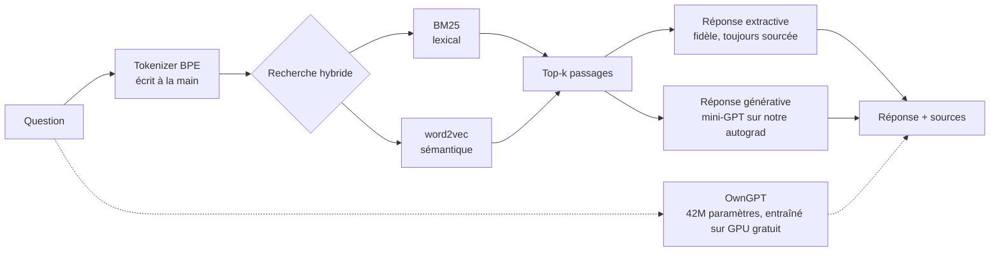
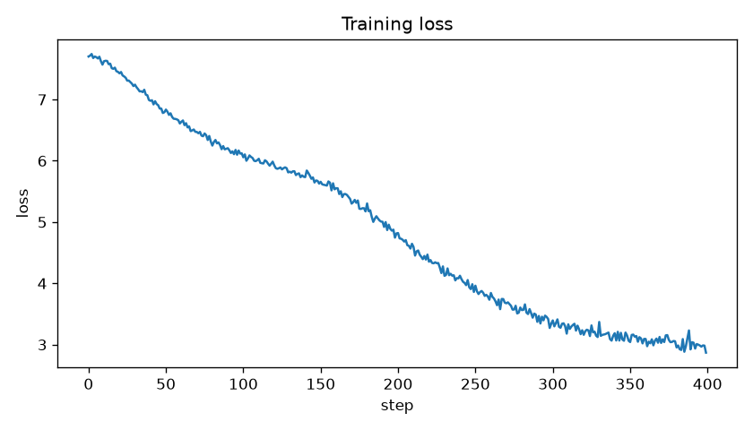

# OwnAI : une IA spécialisée sur un domaine, construite 100 % de zéro

[English 🇬🇧](./README.md)

[](https://github.com/Zlarien/OwnAI/actions/workflows/tests.yml)


> Une IA qui répond aux questions sur **un seul domaine**, et rien d'autre, **sans API d'IA externe, sans modèle préentraîné et sans framework de deep learning**. Le moteur de dérivation automatique, le tokenizer BPE, les embeddings word2vec, l'index BM25 et un mini-GPT sont tous écrits à la main au-dessus de NumPy. **OwnGPT** passe ensuite à l'échelle réelle : son propre tokenizer français, un modèle écrit de zéro sur des tenseurs PyTorch, préentraîné sur un GPU gratuit, puis entraîné à discuter en français.

Les domaines de démonstration sont **New Super Mario Bros. Wii** (en anglais) et **le Système solaire** (en français : même moteur, autre langue, aucune ligne de code changée). Pointe-le vers n'importe quel wiki, dossier de PDF ou de notes avec un petit fichier YAML, et il se spécialise sur ce sujet.



## Pourquoi ce projet

Tous les tutoriels « construis ton propre GPT » importent PyTorch et un tokenizer déjà entraîné. Le cœur de celui-ci n'importe rien d'autre que NumPy pour l'apprentissage. Il montre toute la chaîne d'ingénierie d'une IA, de bout en bout :

| Composant | Écrit de zéro | Preuve que c'est correct |
| --- | --- | --- |
| **Dérivation automatique** | `Tensor`, graphe de calcul, `backward()` | 17 vérifications de gradient par différences finies |
| **Couches de réseau + Adam** | Linear, Embedding, LayerNorm, Dropout, entropie croisée | vérifications de gradient, et résolution d'une régression linéaire à ~0 |
| **Tokenizer BPE** | au niveau des octets, fusions, tokens spéciaux | aller-retour encodage/décodage sans perte |
| **Recherche de documents** | BM25 + word2vec (skip-gram, échantillonnage négatif) | classe le bon passage en premier |
| **Mini-GPT** | attention multi-tête causale, blocs résiduels | mémorise une séquence ; test de fuite du masque causal |
| **RAG + évaluation** | réponses ancrées, garde-fou « je ne sais pas », Recall@k, MRR, perplexité | test du pipeline complet |
| **OwnGPT** | BPE français maison, RoPE, RMSNorm, SwiGLU, génération avec cache KV, entraînement reprenable | le cache KV donne le même résultat que le calcul complet ; un vrai entraînement sur 1 milliard de tokens |

Le tout est couvert par **104 tests qui passent** (`pytest`).

## Démarrage rapide (hors ligne, sans GPU)

Le dépôt contient une petite base de connaissances Mario Wii écrite à la main, pour que tout fonctionne dès le clonage.

```bash
pip install -e .

# 1. Construire le corpus à partir de la base locale
python -m ownai.cli ingest --domain domains/mario-wii.yaml

# 2. Construire le moteur de recherche hybride (BM25 + word2vec)
python -m ownai.cli index  --domain domains/mario-wii.yaml

# 3. Discuter, en mode extractif : fiable, toujours sourcé
python -m ownai.cli chat   --domain domains/mario-wii.yaml
```

```
you > How does Mario become invincible?
ai  > The Super Star makes Mario invincible for a short time. While invincible,
      Mario cannot be hurt by enemies or most hazards.
      sources: powerups (data/mario-wii/knowledge/powerups.md)

you > What is the capital of France?
ai  > I couldn't find anything about that in my knowledge base. Try rephrasing
      with more specific keywords, and note that I only know this one domain.
```

Le répondeur ne parle que si la question partage un terme **informatif** avec le corpus (pondéré par IDF, mots outils filtrés en français comme en anglais). Une question hors domaine ou dans la mauvaise langue reçoit un « je ne sais pas » honnête, plutôt qu'une hallucination assurée.

Mesurer la qualité de la recherche avec de vrais chiffres :

```bash
python -m ownai.cli eval --domain domains/mario-wii.yaml
```

| métrique | valeur |
| --- | --- |
| recall@1 | 1.000 |
| recall@3 | 1.000 |
| mrr | 1.000 |

*(sur le corpus de démonstration fourni)*

## Le mini-GPT génératif (optionnel)

Pour répondre avec le transformeur écrit de zéro au lieu d'extraire des phrases :

```bash
python -m ownai.cli tokenizer --domain domains/mario-wii.yaml   # entraîner le BPE
python -m ownai.cli train     --domain domains/mario-wii.yaml --steps 3000
python -m ownai.cli eval-lm   --domain domains/mario-wii.yaml   # perplexité
python -m ownai.cli chat      --domain domains/mario-wii.yaml --generative
```

[](https://colab.research.google.com/github/Zlarien/OwnAI/blob/main/notebooks/train_colab.ipynb)

La rétropropagation écrite à la main entraîne vraiment. Voici un vrai entraînement : un
modèle de 1,05M de paramètres, planning de learning rate en cosinus, **5000 steps sur un
GPU Colab gratuit**, loss de 7,8 à 0,2 :



Sur ce tout petit corpus, le modèle atteint une loss très basse parce qu'il *apprend le
texte par cœur* (perplexité d'entraînement autour de 1,2) : sa génération libre reste donc
incohérente. C'est le comportement attendu d'un modèle à grande capacité sur un jeu de
données minuscule, et c'est pourquoi le **mode extractif reste la valeur sûre** : le mode
génératif prouve que le transformeur maison s'entraîne et tourne, tandis qu'une génération
cohérente demande des ordres de grandeur de données en plus. C'est exactement le rôle
d'OwnGPT, ci-dessous.

## OwnGPT : un GPT français, construit et entraîné de zéro

Le mini-GPT NumPy prouve chaque gradient à la main, mais il ne peut pas s'entraîner sur des
milliards de tokens. `ownai/gpt/` en est la version à l'échelle, et chaque pièce vit dans ce
dépôt : aucun poids préentraîné, aucun vocabulaire emprunté, aucun modèle téléchargé.

| Pièce | Ce qu'il y a dans le dépôt |
|---|---|
| Tokenizer | notre BPE au niveau des octets, entraîné sur du français (`tokenizer.py`) ; tiktoken ne fait qu'appliquer vite les fusions apprises |
| Modèle | transformeur décodeur : RoPE, RMSNorm, SwiGLU, poids partagés, génération avec cache KV (`model.py`) |
| Préentraînement | FineWeb2-HQ français (web filtré sur la qualité) + Wikipédia FR |
| Entraînement au chat | French-Alpaca + conversations traduites + le jeu d'identité d'OwnGPT ; loss uniquement sur ses réponses |
| Métrique | bits par octet en validation, comparable d'un tokenizer à l'autre |

Pourquoi son propre tokenizer : le vocabulaire de GPT-2 a été construit pour l'anglais. Sur
Wikipédia en français, notre vocabulaire de 32k contient **4,48 caractères par token contre
2,88 pour GPT-2**, donc le même calcul lit environ 55 % de texte en plus.

[](https://colab.research.google.com/github/Zlarien/OwnAI/blob/main/notebooks/owngpt_colab.ipynb)

Le notebook tourne sur les GPU gratuits : **Kaggle** (30 h de GPU par semaine, sessions de
12 h qui continuent navigateur fermé) ou **Colab**. Il adapte la taille du modèle au GPU
(preset `t4`, 42M de paramètres, sur un T4 gratuit ; `base`, 110M, sur un A100), garde les
données et les checkpoints sur un stockage persistant, et reprend après n'importe quelle
coupure. La même chose à la main :

```bash
pip install -e ".[gpt]"
python -m ownai.gpt train-tokenizer                        # notre vocabulaire BPE français
python -m ownai.gpt prepare-pretrain --tokens 1e9
python -m ownai.gpt train --stage pretrain --preset t4 --hours 11   # relancer pour reprendre
python -m ownai.gpt prepare-sft
python -m ownai.gpt train --stage sft --init runs/pretrain/model.pt
python -m ownai.gpt chat runs/sft/model.pt                 # réponses en direct
```

Copie le `model.pt` final dans `artifacts/owngpt/model.pt` et l'interface web gagne un mode
**OwnGPT** : les réponses s'affichent token par token et la conversation est gardée en mémoire.

## Ce qu'OwnGPT sait faire, et ce qu'il ne sait pas faire

Entraîné une fois sur un T4 Kaggle gratuit : 42M de paramètres, 1 milliard de tokens,
environ 7 h 30 pour les deux étapes, **0,68 bit par octet** en validation à la fin. C'est à
peu près le niveau de GPT-2 small, et il se comporte pareil : du français fluide, des faits
peu fiables.

**Ce qui marche**

| Question | Réponse |
| --- | --- |
| Qui es-tu ? | Je suis OwnGPT, un modèle de langage que Mohamed-Zayim a construit et entraîné de zéro, du tokenizer jusqu'au chat. |
| Quelle est la capitale de la France ? | Paris |

Il écrit un français grammatical, respecte le format de conversation, garde le fil des
échanges et connaît son identité (apprise via un petit jeu écrit à la main).

**Ce qui ne marche pas**

> **Qu'est-ce que Paris ?**
> Paris est une ville d'Europe et d'Amérique du Nord située sur la rive droite
> de la Seine, à l'ouest de Paris, dans la région Île-de-France.

> **Comment aller aux Comores depuis Paris ?**
> [...] 1. Accéder aux Comores: Vous pouvez visiter les bâtiments emblématiques
> des quartiers historiques tels que le Louvre, le Louvre et le Panthéon. [...]

Les faits sont inventés, et une question éloignée de ce qu'il a vu reçoit le motif le plus
proche qu'il connaisse. Ce n'est pas un problème de réglage, c'est la taille : un modèle de
42M de paramètres a la place pour la forme de la langue, pas pour le monde.

**Pourquoi ça s'arrête là.** 1 milliard de tokens est déjà le budget optimal pour 42M de
paramètres (environ 20 tokens par paramètre) : continuer le même entraînement n'apporterait
presque rien. Réduire nettement les faits inventés demande un modèle plus gros et plus de
données : environ 110M de paramètres sur 3 à 5 milliards de tokens, soit à peu près 45 h de
GPU sur un T4, et même là il hallucinerait encore. Les vraies pistes sont architecturales,
pas quantitatives :

- **Ancrer les réponses.** Le moteur de recherche de ce dépôt (BM25 + word2vec) peut glisser
  un passage retrouvé dans le prompt, et les données de chat peuvent inclure des questions
  avec contexte, pour que le modèle lise au lieu de se souvenir.
- **Apprendre à refuser.** Le mode extractif s'abstient déjà quand le corpus ne couvre pas la
  question (abstention_accuracy à 1,00) ; OwnGPT n'a pas ce garde-fou.

D'ici là, le partage assumé dans l'interface web tient : **le mode extractif répond avec ses
sources et reste la valeur sûre ; OwnGPT montre ce que donne vraiment un GPT construit de
zéro et entraîné sur un GPU gratuit.**

## Utiliser ton propre domaine

Crée `domains/<ton-sujet>.yaml` :

```yaml
name: mon-sujet
source:
  type: wiki                       # ou : local
  api_url: "https://<wiki>/api.php"
  category: "Category:<Quelque chose>"
# ... découpage / recherche / réglages du modèle
```

Le type de source `wiki` télécharge et nettoie les articles directement depuis n'importe quel
MediaWiki en ligne (vérifié sur la vraie API du [Super Mario Wiki](https://www.mariowiki.com)),
c'est comme ça qu'on construit un corpus vraiment riche.

Ensuite, les mêmes commandes. Le moteur se spécialise sur ton sujet sans changer une ligne de
code. Le dépôt fournit un second domaine, **en français** (`domains/systeme-solaire.yaml`),
pour prouver que le moteur est indépendant du sujet comme de la langue :

```bash
python -m ownai.cli ingest --domain domains/systeme-solaire.yaml
python -m ownai.cli index  --domain domains/systeme-solaire.yaml
python -m ownai.cli chat   --domain domains/systeme-solaire.yaml
# vous > Qu'est-ce qu'une comète ?
# ai   > Une comète est un corps composé de glace et de poussière...
```

## Interface web

Un chat dans le navigateur façon ChatGPT, servi par la **bibliothèque standard de Python
seulement** (ni Flask, ni FastAPI) : l'esprit « tout de zéro » vaut aussi pour la couche web.

```bash
python -m ownai.cli serve
# ouvrir http://127.0.0.1:8000
```

Une seule page sert tous les domaines construits : on change de domaine et de mode de réponse
(extractif, mini-GPT NumPy, OwnGPT) en direct, on part de questions d'exemple, et on déplie
les sources et le temps de réponse sous chaque message. Les réponses d'OwnGPT arrivent token
par token et la conversation est gardée.

## Des chiffres citables

```bash
python -m ownai.cli eval         --domain domains/mario-wii.yaml   # recherche
python -m ownai.cli eval-answers --domain domains/mario-wii.yaml   # réponses
python -m ownai.cli eval-lm      --domain domains/mario-wii.yaml   # perplexité
```

| métrique | valeur | ce que ça veut dire |
| --- | --- | --- |
| recall@1 / mrr | 1,00 / 1,00 | la recherche trouve le bon passage en premier |
| keyword_hit_rate | 1,00 | les réponses dans le domaine contiennent le fait attendu |
| abstention_accuracy | 1,00 | les questions hors domaine sont bien refusées |
| OwnGPT, bits par octet | 0,68 | après 1 milliard de tokens sur un T4 gratuit |

*(les trois premières sur le corpus de démonstration fourni)*

## Architecture

Voir [docs/ARCHITECTURE.md](docs/ARCHITECTURE.md) pour le détail, et [docs/ROADMAP.md](docs/ROADMAP.md).

```
ownai/
├── backend.py     # xp = numpy | cupy  (PC en CPU ou GPU Colab gratuit)
├── autograd/      # Tensor + dérivation automatique en mode inverse
├── nn/            # Linear, Embedding, LayerNorm, Dropout, CrossEntropy, Adam
├── tokenizer/     # BPE au niveau des octets
├── data/          # ingestion générique (MediaWiki + fichiers locaux) vers des chunks
├── retrieval/     # BM25 + word2vec + classement hybride
├── model/         # mini-GPT + boucle d'entraînement ; échantillonnage top-k / top-p / pénalité de répétition
├── rag/           # rechercher puis répondre (extractif et génératif) avec garde-fou de confiance
├── eval/          # Recall@k, MRR, mots-clés et abstention des réponses, perplexité
├── gpt/           # OwnGPT : BPE français maison, transformeur PyTorch, entraînement reprenable, chat
├── web/           # interface de chat, bibliothèque standard seulement
├── pipeline.py    # points d'assemblage
└── cli.py         # ingest / index / tokenizer / train / chat / serve / eval*
```

## Lancer les tests

```bash
pip install -e ".[dev]"
pytest -q          # 104 tests, dont les vérifications de gradient
```

## Licence

MIT.
