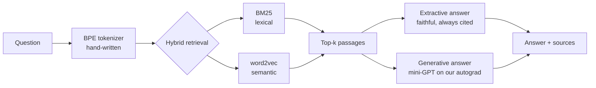

# OwnAI — a domain-specialized AI, built 100% from scratch

[](https://github.com/Zlarien/OwnAI/actions/workflows/tests.yml)


> A question-answering AI that knows **one domain** and nothing else — with **no external AI APIs, no pretrained models, and no deep-learning frameworks**. The autograd engine, BPE tokenizer, word2vec embeddings, BM25 index and a mini-GPT transformer are all implemented by hand on top of NumPy. **OwnGPT** takes the same transformer to real scale: its own French tokenizer, a model written from scratch on PyTorch tensors, pretrained on a free GPU, then fine-tuned to chat in French.

The demo domains are **New Super Mario Bros. Wii** (English) and **le Système solaire** (French — the same engine, another language, zero code change). Point it at any wiki, PDF set, or folder of notes via a small YAML config and it specializes to that subject.



## Why this project

Every "build your own GPT" tutorial imports PyTorch and a pretrained tokenizer. This one doesn't import anything but NumPy for the machine learning. It demonstrates the full AI-engineering stack end to end:

| Component | Built from scratch | Proof it's correct |
| --- | --- | --- |
| **Reverse-mode autograd** | `Tensor`, computation graph, `backward()` | 17 gradient-checks vs. finite differences |
| **NN layers + Adam** | Linear, Embedding, LayerNorm, Dropout, cross-entropy | gradient-checks + solves linear regression to ~0 |
| **BPE tokenizer** | byte-level, merges, special tokens | lossless encode∘decode roundtrip |
| **Retrieval** | BM25 + word2vec (skip-gram, neg. sampling) | ranks the right passage first |
| **Mini-GPT** | causal multi-head attention, residual blocks | memorizes a sequence; causal-mask leak test |
| **RAG + evaluation** | grounded answers, an "I don't know" confidence gate, Recall@k, MRR, perplexity | end-to-end pipeline test |

All of it is covered by **67 passing tests** (`pytest`).

## Quickstart (runs offline, no GPU)

The repo ships with a small hand-written Mario Wii knowledge base so it works immediately after cloning.

```bash
pip install -e .

# 1. Build the corpus from the local knowledge base
python -m ownai.cli ingest --domain domains/mario-wii.yaml

# 2. Build the hybrid retriever (BM25 + word2vec)
python -m ownai.cli index  --domain domains/mario-wii.yaml

# 3. Chat! (extractive mode — reliable, always cites sources)
python -m ownai.cli chat   --domain domains/mario-wii.yaml
```

```
you > How does Mario become invincible?
ai  > The Super Star makes Mario invincible for a short time. While invincible,
      Mario cannot be hurt by enemies or most hazards.
      sources: powerups (data/mario-wii/knowledge/powerups.md)

you > What is the capital of France?
ai  > I couldn't find anything about that in my knowledge base. Try rephrasing
      with more specific keywords — I only know this one domain.
```

The answerer only responds when the question shares an **informative** term with the corpus (IDF-weighted, function words filtered in EN & FR). Out-of-domain or wrong-language questions get an honest "I don't know" instead of a confident hallucination.

Evaluate retrieval quality with real numbers:

```bash
python -m ownai.cli eval --domain domains/mario-wii.yaml
```

| metric | value |
| --- | --- |
| recall@1 | 1.000 |
| recall@3 | 1.000 |
| mrr | 1.000 |

*(on the shipped demo corpus)*

## The generative mini-GPT (optional)

To answer with the from-scratch transformer instead of extracting sentences:

```bash
python -m ownai.cli tokenizer --domain domains/mario-wii.yaml   # train BPE
python -m ownai.cli train     --domain domains/mario-wii.yaml --steps 3000
python -m ownai.cli eval-lm   --domain domains/mario-wii.yaml   # perplexity
python -m ownai.cli chat      --domain domains/mario-wii.yaml --generative
```

[](https://colab.research.google.com/github/Zlarien/OwnAI/blob/main/notebooks/train_colab.ipynb)

The hand-written backprop genuinely trains — here is a real run: a 1.05M-parameter
model, cosine LR schedule, **5000 steps on a free Colab GPU**, loss 7.8 → 0.2:


On this tiny demo corpus the model reaches a very low loss because it *memorizes*
the text (train perplexity ≈ 1.2) — so its free-form generation is still
incoherent. That is the expected behavior of a large-capacity model on a small
dataset, and it is why the **extractive mode is the reliable default**: the
generative mode proves the from-scratch transformer trains and runs, while
coherent generation needs a much larger corpus (switch the domain to `type: wiki`
and retrain). Training is best done on a free GPU — see
`notebooks/train_colab.ipynb`, where NumPy transparently becomes CuPy.

## OwnGPT: a French GPT, built and trained from scratch

The NumPy mini-GPT proves every gradient by hand, but it cannot train on billions
of tokens. `ownai/gpt/` is the scaled-up version, and every piece of it lives in
this repo: no pretrained weights, no borrowed vocabulary, no model zoo.

| Piece | What is in the repo |
|---|---|
| Tokenizer | our own byte-level BPE, trained on French text (`tokenizer.py`); tiktoken only runs the learned merges fast |
| Model | decoder-only transformer: RoPE, RMSNorm, SwiGLU, weight tying, KV-cache generation (`model.py`) |
| Pretraining | FineWeb2-HQ French (quality-filtered web) + French Wikipedia |
| Chat fine-tuning | French-Alpaca + translated chat corpora + OwnGPT's own identity set; loss on its replies only |
| Metric | validation bits per byte, comparable across tokenizers |

Why its own tokenizer: GPT-2's vocabulary was built for English. On French
Wikipedia our 32k vocabulary packs **4.48 characters per token against 2.88 for
GPT-2**, so the same compute reads about 55% more text.

[](https://colab.research.google.com/github/Zlarien/OwnAI/blob/main/notebooks/owngpt_colab.ipynb)

The notebook runs on free GPUs: **Kaggle** (30 GPU hours a week, 12-hour
sessions that keep running with the browser closed) or **Colab**. It sizes the
model to the GPU (`t4` preset, 42M parameters, on a free T4; `base`, 110M, on an
A100), keeps data and checkpoints on persistent storage, and resumes after any
disconnect. Same thing by hand:

```bash
pip install -e ".[gpt]"
python -m ownai.gpt train-tokenizer                        # our French BPE vocabulary
python -m ownai.gpt prepare-pretrain --tokens 1e9
python -m ownai.gpt train --stage pretrain --preset t4 --hours 11   # rerun to resume
python -m ownai.gpt prepare-sft
python -m ownai.gpt train --stage sft --init runs/pretrain/model.pt
python -m ownai.gpt chat runs/sft/model.pt                 # streams its replies
```

Copy the final `model.pt` to `artifacts/owngpt/model.pt` and the web UI gains an
**OwnGPT** mode: replies stream token by token and the conversation is remembered.

## Use your own domain

Create `domains/<your-topic>.yaml`:

```yaml
name: my-topic
source:
  type: wiki                       # or: local
  api_url: "https://<wiki>/api.php"
  category: "Category:<Something>"
# ... chunking / retrieval / model settings
```

The `wiki` source type downloads and cleans articles straight from any live
MediaWiki (verified against the real [Super Mario Wiki](https://www.mariowiki.com)
API) — that is how you build a large, genuinely knowledgeable corpus.

Then run the same commands. The engine specializes to your subject with no code changes. The repo ships a second, **French** domain (`domains/systeme-solaire.yaml` — the Solar System) to prove the engine is both subject- and language-agnostic:

```bash
python -m ownai.cli ingest --domain domains/systeme-solaire.yaml
python -m ownai.cli index  --domain domains/systeme-solaire.yaml
python -m ownai.cli chat   --domain domains/systeme-solaire.yaml
# vous > Qu'est-ce qu'une comète ?
# ai   > Une comète est un corps composé de glace et de poussière...
```

## Web UI

A ChatGPT-style browser chat, served by the Python **standard library only** (no
Flask/FastAPI) — the from-scratch ethos extends to the web layer:

```bash
python -m ownai.cli serve
# open http://127.0.0.1:8000
```

One page serves every built domain: switch domain and answer mode (extractive,
NumPy mini-GPT, OwnGPT) live, start from example questions, and unfold the
sources and latency under each answer.

## Evaluation you can quote

```bash
python -m ownai.cli eval         --domain domains/mario-wii.yaml   # retrieval
python -m ownai.cli eval-answers --domain domains/mario-wii.yaml   # answers
python -m ownai.cli eval-lm      --domain domains/mario-wii.yaml   # perplexity
```

| metric | value | what it means |
| --- | --- | --- |
| recall@1 / mrr | 1.00 / 1.00 | retrieval finds the right passage first |
| keyword_hit_rate | 1.00 | in-domain answers contain the expected fact |
| abstention_accuracy | 1.00 | out-of-domain questions are correctly refused |

*(on the shipped demo corpus)*

## Architecture

See [docs/ARCHITECTURE.md](docs/ARCHITECTURE.md) for the deep dive and [docs/ROADMAP.md](docs/ROADMAP.md).

```
ownai/
├── backend.py     # xp = numpy | cupy  (CPU laptop or free Colab GPU)
├── autograd/      # Tensor + reverse-mode automatic differentiation
├── nn/            # Linear, Embedding, LayerNorm, Dropout, CrossEntropy, Adam
├── tokenizer/     # byte-level BPE
├── data/          # generic ingestion (MediaWiki + local files) → chunks
├── retrieval/     # BM25 + word2vec + hybrid ranking
├── model/         # mini-GPT + training loop; top-k / top-p / repetition-penalty sampling
├── rag/           # retrieve → answer (extractive & generative) with a confidence gate
├── eval/          # Recall@k, MRR, answer keyword hit-rate & abstention, perplexity
├── web/           # stdlib-only browser chat UI
├── pipeline.py    # orchestration seams
└── cli.py         # ingest / index / tokenizer / train / chat / serve / eval*
```

## Running the tests

```bash
pip install -e ".[dev]"
pytest -q          # 67 tests, including the gradient-checks
```

## License

MIT.
