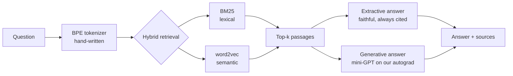

# OwnAI — a domain-specialized AI, built 100% from scratch

> A question-answering AI that knows **one domain** and nothing else — with **no external AI APIs, no pretrained models, and no deep-learning frameworks**. The autograd engine, BPE tokenizer, word2vec embeddings, BM25 index and a mini-GPT transformer are all implemented by hand on top of NumPy.

The demo domains are **New Super Mario Bros. Wii** (English) and **le Système solaire** (French — the same engine, another language, zero code change). Point it at any wiki, PDF set, or folder of notes via a small YAML config and it specializes to that subject.



## Why this project

Every "build your own GPT" tutorial imports PyTorch and a pretrained tokenizer. This one doesn't import anything but NumPy for the machine learning. It demonstrates the full AI-engineering stack end to end:

| Component | Built from scratch | Proof it's correct |
| --- | --- | --- |
| **Reverse-mode autograd** | `Tensor`, computation graph, `backward()` | 17 gradient-checks vs. finite differences |
| **NN layers + Adam** | Linear, Embedding, LayerNorm, Dropout, cross-entropy | gradient-checks + solves linear regression to ~0 |
| **BPE tokenizer** | byte-level, merges, special tokens | lossless encode∘decode roundtrip |
| **Retrieval** | BM25 + word2vec (skip-gram, neg. sampling) | ranks the right passage first |
| **Mini-GPT** | causal multi-head attention, residual blocks | memorizes a sequence; causal-mask leak test |
| **RAG + evaluation** | grounded answers, Recall@k, MRR, perplexity | end-to-end pipeline test |

All of it is covered by **67 passing tests** (`pytest`).

## Quickstart (runs offline, no GPU)

The repo ships with a small hand-written Mario Wii knowledge base so it works immediately after cloning.

```bash
pip install -e .

# 1. Build the corpus from the local knowledge base
python -m ownai.cli ingest --domain domains/mario-wii.yaml

# 2. Build the hybrid retriever (BM25 + word2vec)
python -m ownai.cli index  --domain domains/mario-wii.yaml

# 3. Chat! (extractive mode — reliable, always cites sources)
python -m ownai.cli chat   --domain domains/mario-wii.yaml
```

```
you > How does Mario become invincible?
ai  > The Super Star makes Mario invincible for a short time. While invincible,
      Mario cannot be hurt by enemies or most hazards.
      sources: powerups (data/mario-wii/knowledge/powerups.md)
```

Evaluate retrieval quality with real numbers:

```bash
python -m ownai.cli eval --domain domains/mario-wii.yaml
```

| metric | value |
| --- | --- |
| recall@1 | 1.000 |
| recall@3 | 1.000 |
| mrr | 1.000 |

*(on the shipped demo corpus)*

## The generative mini-GPT (optional)

To answer with the from-scratch transformer instead of extracting sentences:

```bash
python -m ownai.cli tokenizer --domain domains/mario-wii.yaml   # train BPE
python -m ownai.cli train     --domain domains/mario-wii.yaml --steps 3000
python -m ownai.cli eval-lm   --domain domains/mario-wii.yaml   # perplexity
python -m ownai.cli chat      --domain domains/mario-wii.yaml --generative
```

The hand-written backprop genuinely trains — here is the loss on the tiny demo
corpus (1.05M-parameter model, cosine LR schedule, 400 steps on a CPU laptop):


On a small corpus the generative output is still imperfect and can hallucinate —
this is expected and honestly documented. The **extractive mode is the reliable
default**; the generative mode proves the transformer works. Training a real
corpus is best done on a free GPU — see `notebooks/train_colab.ipynb` (NumPy
transparently becomes CuPy).

## Use your own domain

Create `domains/<your-topic>.yaml`:

```yaml
name: my-topic
source:
  type: wiki                       # or: local
  api_url: "https://<wiki>/api.php"
  category: "Category:<Something>"
# ... chunking / retrieval / model settings
```

Then run the same commands. The engine specializes to your subject with no code changes. The repo ships a second, **French** domain (`domains/systeme-solaire.yaml` — the Solar System) to prove the engine is both subject- and language-agnostic:

```bash
python -m ownai.cli ingest --domain domains/systeme-solaire.yaml
python -m ownai.cli index  --domain domains/systeme-solaire.yaml
python -m ownai.cli chat   --domain domains/systeme-solaire.yaml
# vous > Qu'est-ce qu'une comète ?
# ai   > Une comète est un corps composé de glace et de poussière...
```

## Architecture

```
ownai/
├── backend.py     # xp = numpy | cupy  (CPU laptop or free Colab GPU)
├── autograd/      # Tensor + reverse-mode automatic differentiation
├── nn/            # Linear, Embedding, LayerNorm, Dropout, CrossEntropy, Adam
├── tokenizer/     # byte-level BPE
├── data/          # generic ingestion (MediaWiki + local files) → chunks
├── retrieval/     # BM25 + word2vec + hybrid ranking
├── model/         # mini-GPT (decoder-only transformer) + training loop
├── rag/           # retrieve → answer (extractive & generative)
├── eval/          # Recall@k, MRR
├── pipeline.py    # orchestration seams
└── cli.py         # ingest / index / tokenizer / train / chat / eval
```

## Running the tests

```bash
pip install -e ".[dev]"
pytest -q          # 67 tests, including the gradient-checks
```

## License

MIT.
