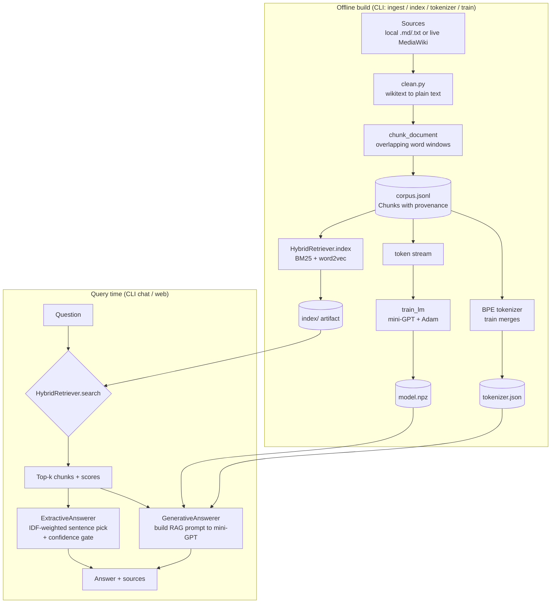
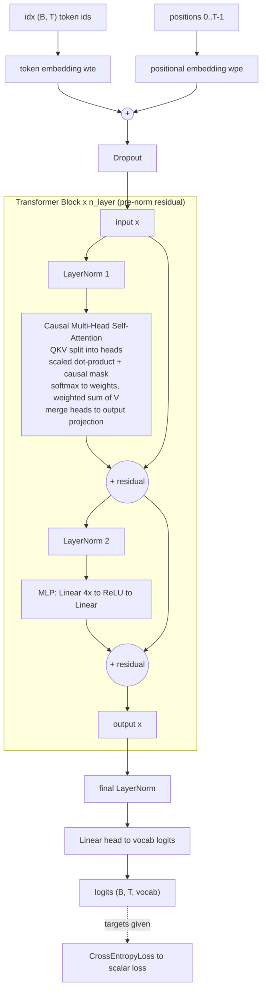

# OwnAI — Architecture

> A domain-specialized question-answering system built **100% from scratch on
> NumPy** — no PyTorch, no TensorFlow, no Hugging Face, no pretrained models, no
> external AI APIs. The autograd engine, BPE tokenizer, word2vec embeddings,
> BM25 index and the mini-GPT transformer are all hand-written and covered by
> gradient-checks and end-to-end tests.

This document is a deep walkthrough of how the pieces fit together, why the key
design decisions were made, and where the honest limitations are. It is written
to be read alongside the code — every claim here maps to a specific module.

---

## 1. The big picture

OwnAI answers questions about **one domain** — and refuses everything else. The
two shipped demo domains are *New Super Mario Bros. Wii* (English) and *le
Système solaire* (French). The same engine specializes to either subject with
**zero code changes**: only a small YAML config and the underlying documents
differ.

Two answering modes sit on top of one shared retriever:

- **Extractive** (the reliable default) — selects the most relevant *verbatim*
  sentences from the corpus. It can never hallucinate, and it always cites its
  sources.
- **Generative** — the from-scratch mini-GPT writes an answer token by token,
  conditioned on the retrieved context. This exists to prove the hand-written
  transformer genuinely trains and runs.

### End-to-end data flow

The **offline** half is run once per domain by the CLI (`ingest` → `index` →
optionally `tokenizer` → `train`). It writes artifacts under
`artifacts/<domain>/`. The **online** half loads those artifacts and answers
questions, either in the terminal (`chat`) or via the stdlib web UI.

---

## 2. Package responsibilities

The repository is one Python package, `ownai/`, deliberately layered so each
concern is small, importable and independently testable.

| Package | Responsibility |
| --- | --- |
| `ownai/backend.py` | Single seam that selects the array library: `xp = numpy` on a laptop CPU, `cupy` on a GPU (Colab). Every other module imports `xp` from here, so the identical from-scratch code runs on either device. Also provides `asnumpy()` and `scatter_add()` (accumulating in-place add needed by backprop-through-indexing). |
| `ownai/autograd/` | The reverse-mode automatic differentiation engine: `Tensor` + a computation graph + `backward()`. This is the foundation everything numeric is built on. |
| `ownai/nn/` | Neural-network building blocks on top of the autograd: `Module`/`Parameter` (PyTorch-like registration and `state_dict`), `Linear`, `Embedding`, `LayerNorm`, `Dropout`, `CrossEntropyLoss`, the `Adam` optimizer and a `cosine_lr` schedule. |
| `ownai/tokenizer/` | Byte-level Byte-Pair Encoding (BPE), the same family as GPT-2's tokenizer. Lossless for any input in any language (starts from the 256 raw bytes, no `<unk>`), with fixed-id special tokens. |
| `ownai/data/` | Generic ingestion. `mediawiki.py` downloads articles from any public MediaWiki export API; `clean.py` turns raw wikitext into plain prose; `corpus.py` defines `Document`/`Chunk` and slices documents into overlapping, source-tagged windows persisted as JSONL. |
| `ownai/retrieval/` | The hybrid retriever. `bm25.py` (lexical), `word2vec.py` (skip-gram + negative sampling, semantic), `tokenize.py` (a simple word tokenizer distinct from the BPE one), and `hybrid.py` which normalizes and blends both signals and handles persistence. |
| `ownai/model/` | The mini-GPT: `config.py` (`GPTConfig` hyperparameters), `gpt.py` (decoder-only transformer built on the autograd), `train.py` (dataset batching, training loop, perplexity eval). |
| `ownai/rag/` | Retrieval-augmented answering: `answer.py` holds the `ExtractiveAnswerer`, the `GenerativeAnswerer`, RAG prompt assembly and the confidence gate. |
| `ownai/eval/` | Retrieval quality metrics: `recall_at_k`, `mrr`, and a driver that runs a QA set through a retriever and returns a report. |
| `ownai/pipeline.py` | High-level orchestration "seams" — corpus building, index building, token-stream flattening, domain-config loading. Keeping these here (not inside the CLI scripts) makes the whole flow importable and testable. |
| `ownai/cli.py` | The command-line interface: `ingest`, `index`, `tokenizer`, `train`, `chat`, `eval`, `eval-lm`. Every domain is one small YAML file, so the same code specializes to any subject by swapping the config. |
| `ownai/web/` | A chat UI served with **only the Python standard library** (`http.server`) — no Flask/FastAPI. Exposes `serve`, `build_handler`, `answer_to_json` and the page HTML, keeping the from-scratch ethos all the way to the browser. |

---

## 3. The autograd engine (`ownai/autograd/tensor.py`)

Everything numeric in the neural half of OwnAI is a `Tensor`. A `Tensor` wraps an
`xp` array and, whenever an operation is applied, records:

1. its **parents** (`_prev`) — the inputs that produced it, and
2. a closure **`_backward`** — how to push a gradient from this node back to
   those parents via the chain rule.

This is exactly the mechanism PyTorch uses, reimplemented by hand.

### Forward: build the graph

Each operation (`__add__`, `__mul__`, `__matmul__`, `exp`, `log`, `tanh`,
`relu`, `sum`, `mean`, `reshape`, `transpose`, `__getitem__`, `softmax`,
`log_softmax`, …) computes its output array and stitches a new node into the
graph. `_make` propagates `requires_grad` — a node tracks gradients only if at
least one parent does, so inference builds no graph and stays cheap.

Two subtleties handled with care:

- **Broadcasting.** NumPy silently broadcasts shapes in the forward pass, so the
  backward pass must *un-broadcast* the gradient back to each operand's original
  shape. `_unbroadcast` sums over the broadcasted axes — this is what makes bias
  addition and scalar multiplication differentiate correctly.
- **Numerically-stable `softmax`/`log_softmax`.** Both subtract the per-axis max
  before exponentiating, and their backward passes use the closed-form Jacobians
  rather than differentiating through the exp/sum (more stable and much faster).
  `CrossEntropyLoss` is built on `log_softmax` + a gather, never on a raw
  `log(softmax)`.

### Backward: reverse-mode over a topological order

`backward()` is only valid on a scalar (a loss). It performs an **iterative**
(explicit-stack) topological sort of the graph — iterative, not recursive,
because a multi-layer transformer's graph is far too deep for Python's recursion
limit. It then seeds the output gradient to ones and walks nodes in reverse
topological order, calling each `_backward`. Gradients **accumulate** (`_add_grad`
sums rather than overwrites), which is what makes a tensor used more than once
(for example a weight matrix applied at every time step, or a reused activation)
receive the sum of gradients from all its uses.

### Proof it is correct: gradient-checking

The engine is not trusted on faith. `tests/test_autograd.py` compares every
analytic gradient against a **central finite-difference** numerical gradient
(`(f(x+ε) − f(x−ε)) / 2ε`) at `1e-4` tolerance. The suite covers arithmetic and
broadcasting, matmul (including batched), the element-wise ops, reductions, shape
ops, `softmax`/`log_softmax`, fancy indexing shaped like an embedding lookup and
like cross-entropy's row/column gather, gradient accumulation on reuse, and the
guards (no-grad when not required, scalar-only `backward`). If those pass, the
backprop is mathematically correct — and it is on those gradients that the whole
`nn/` and `model/` stack rests.

---

## 4. Retrieval: the hybrid index

Retrieval is where a question meets the corpus. OwnAI blends two classic,
complementary signals.

### BM25 — lexical (`retrieval/bm25.py`)

The strong lexical baseline: term-frequency saturation (`k1`) and
document-length normalization (`b`), weighted by smoothed inverse document
frequency (IDF). It nails exact-term matches. Importantly, its per-term **IDF
table is reused downstream** by the extractive answerer's confidence gate (see
§7) — rare terms are informative, common ones are not.

### word2vec — semantic (`retrieval/word2vec.py`)

Skip-gram with **negative sampling**, trained with plain NumPy SGD: for each
(target, context) pair it pulls the target's input vector toward the true
context vector and away from `negative` noise words drawn from the classic
unigram^0.75 distribution. The learned input embeddings give each word a dense
vector; a chunk (or a query) is embedded as the **mean of its known word
vectors**. This catches paraphrases — a user who types words the corpus phrases
differently.

### Blending (`retrieval/hybrid.py`)

`HybridRetriever.index()` tokenizes every chunk (with the simple word tokenizer,
not BPE), fits BM25, trains word2vec, and precomputes unit-normalized document
vectors for fast cosine. At query time, `search()`:

1. computes BM25 lexical scores and word2vec cosine semantic scores,
2. **min-max normalizes each to [0, 1]** so neither signal's raw scale
   dominates,
3. blends them: `alpha * semantic + (1 - alpha) * lexical` (default
   `alpha = 0.5`), and
4. returns the top-k `(Chunk, score)` pairs.

The index is persisted (`chunks.jsonl` + a `state.pkl` holding the trained
word2vec and document vectors) and reloaded at chat time. (The pickle is only
ever the project's own locally-built artifact — see the note in `hybrid.py`; it
should never be pointed at an untrusted file.)

Retrieval quality is measured, not vibed: `ownai/eval/` computes **Recall@k** and
**MRR** over a small hand-written QA set (`recall@1/3 = 1.000`, `mrr = 1.000` on
the shipped demo corpus).

---

## 5. Tokenizer and corpus

### BPE tokenizer (`tokenizer/bpe.py`)

Byte-level BPE, the GPT-2 family algorithm: start from the 256 raw byte values
(so encoding is **lossless for any input in any language, with no `<unk>`**),
then repeatedly merge the most frequent adjacent token pair until the target
vocab size is reached. Encoding replays the learned merges greedily; decoding
expands merged ids back to bytes and UTF-8-decodes with `errors="replace"` so it
never crashes on the arbitrary byte streams a partially-trained generator can
emit. Special tokens (`<|bos|>`, `<|sep|>`, `<|eos|>`) get fixed ids just above
the byte range and are never split. A roundtrip test proves `decode(encode(x)) ==
x`.

### Corpus (`data/`)

A `Document` is one source article; `chunk_document` slices it into overlapping
word windows (default 160–180 words, 30 overlap) so retrieval units are
bite-sized yet don't sever context at boundaries. Each `Chunk` carries its
**title + source**, which is what lets every answer cite where it came from.
Corpora are stored as JSONL. Ingestion is generic: local `.md`/`.txt` folders,
or live wiki articles fetched via the MediaWiki export API and cleaned from
wikitext to prose by `clean.py`.

---

## 6. The mini-GPT (`ownai/model/`)

A decoder-only transformer, GPT-2-shaped but scaled down, built **entirely on
the autograd** — every attention score, causal mask, softmax and residual flows
through `Tensor`, so training uses the hand-written backprop end to end.

### Block structure

- **Causal self-attention** (`CausalSelfAttention`) projects the input to Q, K, V
  in one `Linear`, splits into heads via reshape+transpose, computes scaled
  dot-product attention, and **adds a precomputed upper-triangular `-1e9`
  mask** before softmax so a position can never attend to the future. A dedicated
  test (`test_causal_masking_prevents_future_leakage`) confirms that changing a
  later token leaves earlier-position logits bit-for-bit identical.
- **Pre-norm residual blocks**: `x = x + attn(ln1(x))` then
  `x = x + mlp(ln2(x))` — LayerNorm before each sublayer, residual around it,
  the stable GPT-2 arrangement.
- **MLP** is the standard 4× expansion with a ReLU nonlinearity.
- The head maps back to vocab logits; with `targets` given, the model returns the
  cross-entropy **loss** directly.

Default demo config: `block_size=128`, `n_layer=4`, `n_head=4`, `n_embd=128`,
`vocab_size≈3000` — on the order of ~1M parameters.

### Training and generation (`model/train.py`, `GPT.generate`)

`LMDataset` slices the flattened token stream into random `(x, next-token)`
windows. `train_lm` runs Adam (hand-written, with bias correction and weight
decay) under a linear-warmup + cosine-decay LR schedule, logging a loss/lr
history. `evaluate_perplexity` reports `exp(mean loss)` over sampled windows.
`generate` samples autoregressively with temperature and optional top-k, always
cropping context to `block_size`. Weights serialize to a plain `.npz`.
`tests/test_model.py` shows the loop genuinely learns: it **overfits a short
sequence to loss < 0.1** (a correct transformer + optimizer must memorize it).

---

## 7. The confidence gate — and why it matters

The single most important design decision for trustworthiness lives in
`ExtractiveAnswerer.answer` (`ownai/rag/answer.py`). A domain AI that confidently
answers *"What is the capital of France?"* from a Mario corpus is worse than
useless. OwnAI instead says **"I don't know"** — honestly — when the question is
out of domain or in the wrong language.

The gate works in two IDF-driven steps:

1. **Informative-term filter.** From the query, keep only terms that actually
   carry topic meaning **in this corpus**: not a bilingual function word (see
   below), present in the corpus, and **not in the low-IDF tail** (the most
   common ~20% of vocabulary — words like *"the"* or *"mario"* that match
   everything and distinguish nothing). This reuses the BM25 IDF table computed
   during indexing.
2. **Relevance requirement.** A candidate answer sentence is kept only if it
   shares at least one of those informative terms. If **no** sentence qualifies,
   the query hasn't really been answered → return the honest `NOT_FOUND` message
   instead of the top-scoring-but-irrelevant sentence.

Sentence *ranking* (among sentences that pass the gate) uses an **IDF-weighted
overlap** score, `sum(idf of shared terms) / sqrt(sentence length)`, so matching
a rare term like *"comet"* counts far more than matching *"is"*, and the chosen
sentence genuinely addresses the question rather than merely being long.

**Bilingual stopwords.** The `STOPWORDS` set contains English **and** French
function words (`the/le`, `what/quel`, `how/comment`, elision fragments `d`/`l`/
`qu`, …). This is what makes the gate language-aware: a French question against
the English Mario corpus shares only function words → nothing informative →
honest refusal, and vice versa. The same engine, one gate, two languages.

Why it matters: this is the difference between a demo that *looks* smart until
you probe it and a system a recruiter or user can actually trust. It converts
"the chatbot feels okay" into a defined, testable contract: **answer only when
there is real informative overlap; otherwise admit ignorance.**

---

## 8. RAG modes

- **Extractive** (`ExtractiveAnswerer`) — retrieve top-k chunks, split into
  unique sentences (de-duplicating chunk-overlap fragments by keeping the longest
  form), score by IDF-weighted overlap, apply the confidence gate, and return up
  to `max_sentences` **verbatim** sentences plus their source labels. It cannot
  hallucinate: every word comes from the corpus.
- **Generative** (`GenerativeAnswerer`) — retrieve context, assemble a RAG prompt
  (`Context: … Question: … Answer:`), feed the last `block_size` tokens to the
  mini-GPT, and decode the generated continuation. The retrieved sources are
  always shown alongside, because the generated text is the less-reliable mode.

---

## 9. Honest limitations

This project is explicit about what it does and does not do — that honesty is
part of its point.

- **Small-corpus overfitting.** On the tiny shipped demo corpus, the mini-GPT
  reaches very low loss because it **memorizes** the text (train perplexity ≈
  1.2). Its free-form generation is therefore still incoherent. That is the
  *expected* behavior of a high-capacity model on a small dataset, and it is
  precisely why **extractive mode is the reliable default**. The generative mode
  is a proof that the from-scratch transformer trains and runs — coherent
  generation needs a much larger corpus (switch a domain to `type: wiki` and
  retrain on Colab).
- **Corpus-language answering.** OwnAI answers **in the language of its corpus**
  and only about that one domain. This is by design (the confidence gate enforces
  it), but it means a French question to an English domain gets a refusal, not a
  translation.
- **Retrieval embeddings are simple.** word2vec mean-pooling is a bag-of-words
  sentence embedding: no word order, no subword coverage for out-of-vocabulary
  query terms. It is a deliberate from-scratch baseline, not a sentence
  transformer.
- **Scale.** Everything runs on NumPy (CPU) or CuPy (a single free GPU). This is
  an engineering demonstration of the full stack, not a system tuned for
  production-scale corpora or latency.

These are documented, not hidden — and the roadmap (`docs/ROADMAP.md`) lays out
how each would be pushed further.
